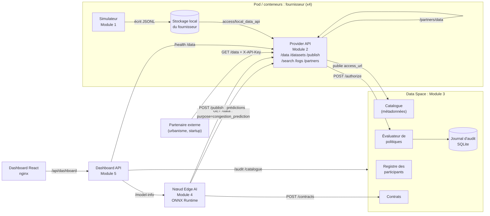
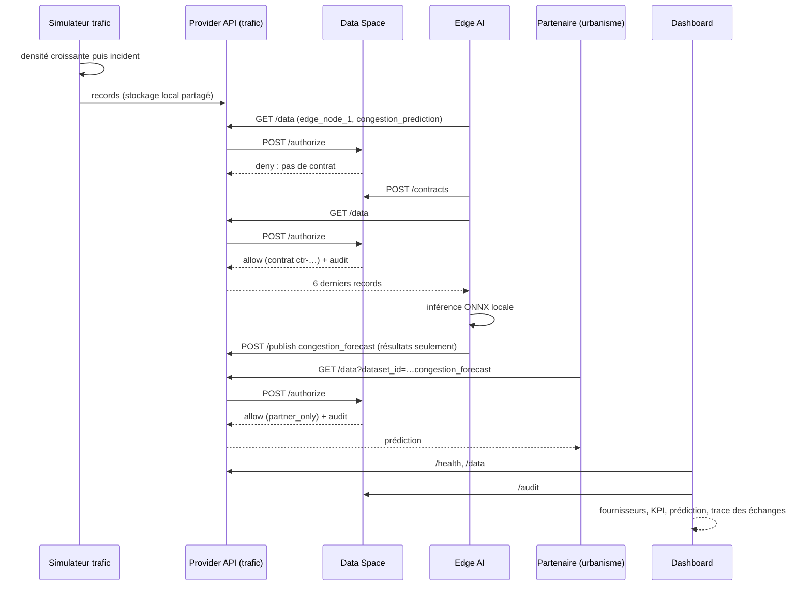

# Cahier d'architecture : Smart Mobility Data Space

## 1. Objectif

Prototype de Data Space pour la mobilité urbaine (Grand Tunis). Plusieurs fournisseurs partagent leurs
données de façon contrôlée afin d'améliorer la gestion du trafic, la prévision des embouteillages et
l'information sur le stationnement. Trois principes guident l'architecture :

1. **Souveraineté** : chaque fournisseur garde ses données brutes localement et décide de leur politique d'usage.
2. **Contrôle** : toute donnée sort uniquement par une API, après une décision d'autorisation tracée.
3. **Edge AI** : les prédictions sont calculées près de la source ; seuls les résultats utiles sont partagés.

## 2. Acteurs

| Acteur (participant) | Type | Rôles | Adhésion |
|---|---|---|---|
| `traffic_sensor_1`, capteurs de trafic | fournisseur | provider, traffic_operator | member |
| `bus_line_12`, réseau de bus (ligne L12) | fournisseur | provider, transport_operator | member |
| `parking_lot_5`, parking intelligent | fournisseur | provider, parking_operator | member |
| `bikes_zone_a`, vélos en libre-service | fournisseur | provider, micromobility_operator | member |
| `edge_node_1`, nœud Edge AI | consommateur | edge_ai, analytics | member |
| `dashboard_operator`, centre d'exploitation | consommateur | operator, monitoring | member |
| `city_planning_office`, urbanisme | consommateur | public_authority | member |
| `mobility_startup_x`, startup externe | consommateur | commercial | guest |

## 3. Cas d'utilisation

| # | Cas d'utilisation | Acteurs | Résultat attendu |
|---|---|---|---|
| UC1 | Publier des données de mobilité | fournisseurs | données conservées localement, offre publiée au catalogue |
| UC2 | Découvrir un jeu de données | tout participant | métadonnées via `/catalogue` ou `/search` (jamais les données brutes) |
| UC3 | Négocier un contrat de partage | membre | contrat (finalité, rétention, expiration) si la politique le permet |
| UC4 | Consulter des données autorisées | participant | données si la politique et le contrat le permettent, sinon 403 motivé |
| UC5 | Prédire la congestion en périphérie | edge_node_1 | prédiction locale, publiée comme jeu dérivé |
| UC6 | Échange entre fournisseurs | bus_line_12 → traffic_sensor_1 | accès aux données de trafic via découverte catalogue + contrat |
| UC7 | Auditer les échanges | opérateur | journal : qui, quoi, quand, finalité, politique, décision |
| UC8 | Superviser le système | dashboard_operator | état des fournisseurs, santé des API, KPI, prédictions, échanges |

## 4. Diagramme des composants



## 5. Séquence du scénario d'intégration final



## 6. Choix techniques

| Sujet | Choix | Justification |
|---|---|---|
| Langage / API | Python 3.12, FastAPI | imposé ; OpenAPI/Swagger générés automatiquement |
| Stockage fournisseur | fichiers JSONL par fournisseur et par jour | simple, lisible, isolement physique par dossier/volume |
| Stockage gouvernance | SQLite (contrats, audit, statut catalogue) | persistance sans serveur ; PostgreSQL optionnel dans le sujet |
| Identité | clé API par participant (`X-API-Key`) + jeton de service entre connecteurs | simulation légère des identités Gaia-X (credentials vérifiables) |
| Politiques | 5 types + contraintes (rôles, finalités, contrat, rétention, redistribution) | couvre les exemples du sujet et reste testable unitairement |
| Modèle Edge | Random forest → ONNX | léger, exportable, 0,085 ms par prédiction |
| Frontend | React + Vite, SVG sans dépendance graphique | travail du membre 5 conservé, branché sur une API d'agrégation |
| Déploiement | Docker Compose (local), Kubernetes (Minikube/Kind) | imposé ; sondes readiness/liveness, ConfigMap/Secret |

## 7. Correspondance avec les principes Gaia-X

| Principe | Mise en œuvre |
|---|---|
| Souveraineté des données | données brutes uniquement dans le stockage du fournisseur ; volumes/pods séparés ; seul le propriétaire publie son offre ou modifie sa politique |
| Contrôle des accès | décision centralisée `/authorize`, fail-closed (503) si la gouvernance est indisponible |
| Partage sécurisé entre partenaires | adhésion member/guest, rôles, contrats avant accès aux données sensibles |
| Politiques d'usage | `public`, `partner_only`, `role_based`, `purpose_limited`, `denied` ; finalité déclarée à chaque requête |
| Traçabilité | journal d'audit persistant de chaque décision + journal de requêtes de chaque API |
| Catalogue / fédération | auto-description des jeux de données, `access_url` publiée par chaque fournisseur, découverte via `/search?scope=data_space` |

## 8. Organisation du dépôt

```text
feat/data-simulation/          Module 1 : simulateurs, scénario, schéma, tests
feat/distributed-api/          Module 2 : template FastAPI des fournisseurs, client inter-services
feat/data-space/               Module 3 : registre, catalogue, politiques, contrats, audit
feat/edge-ai/                  Module 4 : entraînement, modèle ONNX, service d'inférence
feat/dashboard-devops/         Module 5 : dashboard React + API d'agrégation
shared/                        schéma commun + contrats d'API (revus par les 5 membres)
deploy/docker, docker-compose.yml, deploy/k8s/   déploiement
scripts/                       run_local.py (sans Docker), smoke_test.py
tests/integration/             test bout-en-bout en processus
docs/                          architecture, rapport final, démonstration
```
