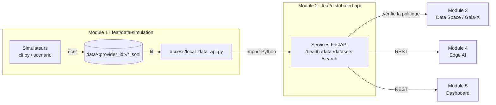

# Guide d'intégration : Module 1 (Data Simulation) → Module 2 (Distributed API)

**Destinataire :** Membre 2, branche `feat/distributed-api`
**Fourni par :** Membre 1, branche `feat/data-simulation`

Ce guide explique tout ce dont tu as besoin du Module 1 pour construire tes services FastAPI : ce qui est fourni, le contrat à respecter, les étapes dans l'ordre et un exemple d'API testé sur les vraies données.

---

## Sommaire

1. [En bref](#1-en-bref)
2. [Où se place le Module 1 dans l'architecture](#2-où-se-place-le-module-1-dans-larchitecture)
3. [Ce que le Module 1 te fournit](#3-ce-que-le-module-1-te-fournit)
4. [Les providers et le format des données](#4-les-providers-et-le-format-des-données)
5. [Le contrat : l'API Python d'accès](#5-le-contrat--lapi-python-daccès)
6. [Étapes d'intégration](#6-étapes-dintégration)
7. [Exemple complet de service FastAPI](#7-exemple-complet-de-service-fastapi)
8. [Tester ton intégration](#8-tester-ton-intégration)
9. [Préparer la démo finale](#9-préparer-la-démo-finale)
10. [Pièges connus et dépannage](#10-pièges-connus-et-dépannage)
11. [Règles à respecter](#11-règles-à-respecter)
12. [Checklist finale](#12-checklist-finale)

---

## 1. En bref

```powershell
cd feat/data-simulation
python -m pip install -r requirements.txt
python -m pytest tests/ -v                                     # 12 tests doivent passer
python cli.py start --provider traffic_sensor_1 --count 1000   # génère des données
```

```python
import sys; sys.path.append("chemin/vers/feat/data-simulation")
from access.local_data_api import get_latest_records, get_records_since, list_available_providers

list_available_providers()                      # ['bikes_zone_a', 'bus_line_12', 'parking_lot_5', 'traffic_sensor_1']
get_latest_records("traffic_sensor_1", 10)      # 10 derniers records (liste de dict)
```

C'est tout ce qu'il te faut pour commencer. Le reste de ce guide détaille chaque point.

---

## 2. Où se place le Module 1 dans l'architecture



- Le Module 1 **produit et garde** les données brutes localement (souveraineté des données).
- Le Module 2 est **le seul** module qui accède au Module 1, et uniquement via `access/local_data_api.py`.
- Les Modules 4 et 5 ne voient les données **qu'à travers tes endpoints REST**.

---

## 3. Ce que le Module 1 te fournit

| Élément | Emplacement | Utilité pour toi |
|---|---|---|
| **API d'accès Python** | `access/local_data_api.py` | Ton **unique** point d'entrée vers les données |
| Schéma JSON commun | `schemas/mobility_record.schema.json` | Référence pour tes modèles Pydantic et ta doc OpenAPI |
| Configuration des providers | `config/config.yaml` | Types, positions, intervalles (informatif) |
| Seeds | `config/seeds.yaml` | Mêmes données à chaque génération (tests reproductibles) |
| CLI des simulateurs | `cli.py` | Générer des données pendant ton développement |
| Scénario de démo | `scenario/scenario_generator.py` | Congestion forcée pour la démo finale |
| Données d'exemple | `data/<provider_id>/YYYY-MM-DD.jsonl` | 1000 records par provider (**ne pas lire directement**) |

---

## 4. Les providers et le format des données

### 4.1 Providers disponibles

| provider_id | Type | Fréquence | Position | Champs spécifiques |
|---|---|---|---|---|
| `traffic_sensor_1` | Capteur de trafic | 1 record / 5 s | fixe | `speed`, `traffic_density` |
| `bus_line_12` | Bus (ligne L12) | 1 record / 10 s | 3 arrêts, change toutes les 5 min | `route_id`, `delay_min` |
| `parking_lot_5` | Parking (120 places) | 1 record / 15 s | fixe | `occupancy` |
| `bikes_zone_a` | Flotte de 25 vélos | 1 record / 10 s | mobile (rayon 1,5 km) | `battery_level`, `status` |

Toutes les positions sont à Tunis, autour de (36.80, 10.18).

### 4.2 Champs d'un record

**Toujours présents :** `provider_id`, `timestamp`, `latitude`, `longitude`, `incident`.

| Champ | Type | Plage / valeurs | Provider |
|---|---|---|---|
| `provider_id` | string | ex. `traffic_sensor_1` | tous |
| `timestamp` | string ISO 8601 | `2026-09-28T09:41:24.763034` (heure locale, **sans fuseau**) | tous |
| `latitude`, `longitude` | float | degrés WGS84 | tous |
| `incident` | bool | voir tableau 4.3 | tous |
| `speed` | float | ≥ 0 km/h | trafic |
| `traffic_density` | float | 0 à 1 | trafic |
| `route_id` | string | `L12` | bus |
| `delay_min` | float | ≥ 0 minutes | bus |
| `occupancy` | float | 0 à 1 | parking |
| `battery_level` | float | 0 à 100 % | vélos |
| `status` | string | `available`, `in_use`, `low_battery` | vélos |

### 4.3 Signification de `incident`

| Provider | `incident = true` quand… |
|---|---|
| `traffic_sensor_1` | état *incident* ou *congestion* (vitesse très basse, densité > 0,7) |
| `bus_line_12` | bus en panne (retard ~20 min) |
| `parking_lot_5` | parking presque plein |
| `bikes_zone_a` | jamais (toujours `false`) |

### 4.4 Exemples réels

```json
{"provider_id": "traffic_sensor_1", "timestamp": "2026-09-28T09:41:24.763034", "latitude": 36.8065, "longitude": 10.1815, "speed": 21.9, "traffic_density": 0.26, "incident": false}
{"provider_id": "bus_line_12", "timestamp": "2026-09-28T09:47:29.174328", "latitude": 36.8065, "longitude": 10.1815, "route_id": "L12", "delay_min": 2.2, "incident": false}
{"provider_id": "parking_lot_5", "timestamp": "2026-09-28T09:41:56.564208", "latitude": 36.8, "longitude": 10.18, "occupancy": 0.8, "incident": false}
{"provider_id": "bikes_zone_a", "timestamp": "2026-09-28T09:47:37.906513", "latitude": 36.802799, "longitude": 10.187046, "battery_level": 58.7, "status": "available", "incident": false}
```

Chaque record est validé contre le schéma **avant** d'être écrit : tout ce que tu lis est garanti conforme.

---

## 5. Le contrat : l'API Python d'accès

```python
from access.local_data_api import get_latest_records, get_records_since, list_available_providers
```

### `list_available_providers() -> list[str]`
Liste des providers qui ont un dossier dans `data/`. L'ordre n'est pas garanti : trie si besoin.

### `get_latest_records(provider_id: str, limit: int = 50) -> list[dict]`
Les `limit` derniers records écrits, **du plus ancien au plus récent** (le dernier élément est le plus récent).
Retourne `[]` si le provider n'existe pas ou n'a pas de données.

### `get_records_since(provider_id: str, since: datetime) -> list[dict]`
Tous les records dont `timestamp >= since`, dans l'ordre du fichier.
- `since` doit être un `datetime` **sans fuseau horaire** (voir [§10](#10-pièges-connus-et-dépannage)).
- Il n'y a pas de limite : pense à tronquer côté API.

Garanties :
- Les données sont relues à **chaque appel** : les records écrits par un simulateur en cours d'exécution sont visibles immédiatement.
- Les fonctions **ne modifient jamais** les données (lecture seule).
- Le filtrage par position, par champ ou par date de fin est **à ta charge** (voir l'exemple §7).

---

## 6. Étapes d'intégration

### Étape 1 : récupérer le module
Récupère `feat/data-simulation` via la branche d'intégration de l'équipe, puis :
```powershell
cd feat/data-simulation
python -m pip install -r requirements.txt
python -m pytest tests/ -v
```
Résultat attendu : `12 passed`.

### Étape 2 : rendre le module importable
`access` est un package situé dans `feat/data-simulation/`. Pour respecter la règle « config par variables d'environnement », passe son chemin via une variable :

```powershell
$env:DATA_SIMULATION_PATH = "C:\...\feat\data-simulation"
```
```python
import os, sys
sys.path.append(os.environ.get("DATA_SIMULATION_PATH", "../data-simulation"))
from access.local_data_api import get_latest_records, get_records_since, list_available_providers
```

### Étape 3 : générer des données de travail
**Mode batch** (instantané, idéal pour développer) :
```powershell
python cli.py start --provider traffic_sensor_1 --count 1000
python cli.py start --provider bus_line_12 --count 1000
python cli.py start --provider parking_lot_5 --count 1000
python cli.py start --provider bikes_zone_a --count 1000
```
**Mode continu** (temps réel, pour tester le « live »), un terminal par provider :
```powershell
python cli.py start --provider traffic_sensor_1    # Ctrl+C pour arrêter
```
Les données s'**ajoutent** aux fichiers existants. Pour repartir de zéro : `Remove-Item -Recurse data\<provider_id>`.

### Étape 4 : exposer les données en REST
Correspondance recommandée :

| Endpoint (Module 2) | Appel au Module 1 | Traitement côté Module 2 |
|---|---|---|
| `GET /health` | `list_available_providers()` | statut du service |
| `GET /datasets` | `list_available_providers()` + `get_latest_records(pid, 1)` | métadonnées (champs, dernier timestamp) |
| `GET /data?provider_id=&limit=` | `get_latest_records()` | 404 si provider inconnu |
| `GET /data?provider_id=&since=&until=` | `get_records_since()` | filtre `until`, tronque à `limit` |
| `GET /data?...&incident=true` | idem | filtre sur `incident` |
| `GET /search?lat=&lon=&radius_km=` | `get_latest_records()` sur chaque provider | filtre par distance |

Un exemple complet et testé est donné au [§7](#7-exemple-complet-de-service-fastapi).

### Étape 5 : ajouter ta couche de contrôle
Le Module 1 ne fait **ni authentification, ni autorisation, ni logs**. C'est ton rôle :
1. authentification (API key ou JWT) ;
2. appel au service de politique du **Membre 3** avant de renvoyer des données protégées ;
3. log de chaque requête (qui, quoi, quand).

### Étape 6 : valider puis préparer la démo
Écris tes tests (§8), puis répète le scénario de démo (§9).

---

## 7. Exemple complet de service FastAPI

Exemple **testé sur les données réelles du Module 1** : `/health`, `/datasets`, `/data` avec tous ses filtres, le 404 et `/search` fonctionnent.
Dépendances en plus : `pip install fastapi uvicorn`.

```python
# main.py
import math
import os
import sys
from datetime import datetime
from typing import Optional

from fastapi import FastAPI, HTTPException, Query

# Chemin vers feat/data-simulation (configurable par variable d'environnement)
sys.path.append(os.environ.get("DATA_SIMULATION_PATH", "../data-simulation"))
from access.local_data_api import get_latest_records, get_records_since, list_available_providers

app = FastAPI(title="Mobility Provider API")


def _check_provider(provider_id: str):
    if provider_id not in list_available_providers():
        raise HTTPException(status_code=404, detail=f"Provider inconnu : {provider_id}")


def _distance_km(lat1, lon1, lat2, lon2):
    r = 6371
    dlat, dlon = math.radians(lat2 - lat1), math.radians(lon2 - lon1)
    a = math.sin(dlat / 2) ** 2 + math.cos(math.radians(lat1)) * math.cos(math.radians(lat2)) * math.sin(dlon / 2) ** 2
    return 2 * r * math.asin(math.sqrt(a))


@app.get("/health")
def health():
    return {"status": "ok", "providers": len(list_available_providers())}


@app.get("/datasets")
def datasets():
    result = []
    for pid in sorted(list_available_providers()):
        last = get_latest_records(pid, limit=1)
        result.append({
            "provider_id": pid,
            "last_timestamp": last[0]["timestamp"] if last else None,
            "fields": sorted(last[0].keys()) if last else [],
        })
    return result


@app.get("/data")
def data(
    provider_id: str,
    limit: int = Query(50, ge=1, le=1000),
    since: Optional[datetime] = None,
    until: Optional[datetime] = None,
    incident: Optional[bool] = None,
):
    _check_provider(provider_id)
    if since:
        records = get_records_since(provider_id, since.replace(tzinfo=None))
    else:
        records = get_latest_records(provider_id, limit)
    if until:
        records = [r for r in records if datetime.fromisoformat(r["timestamp"]) <= until.replace(tzinfo=None)]
    if incident is not None:
        records = [r for r in records if r["incident"] == incident]
    return records[-limit:]


@app.get("/search")
def search(lat: float, lon: float, radius_km: float = 1.0, limit: int = Query(50, ge=1, le=1000)):
    hits = []
    for pid in list_available_providers():
        for r in get_latest_records(pid, limit):
            if _distance_km(lat, lon, r["latitude"], r["longitude"]) <= radius_km:
                hits.append(r)
    return hits
```

Lancement :
```powershell
$env:DATA_SIMULATION_PATH = "C:\...\feat\data-simulation"
uvicorn main:app --port 8001 --reload
```
Puis ouvre http://localhost:8001/docs (Swagger généré automatiquement).

Exemples de requêtes :
```
GET /data?provider_id=traffic_sensor_1&limit=10
GET /data?provider_id=traffic_sensor_1&since=2026-09-28T10:00:00&until=2026-09-28T10:10:00&incident=true
GET /search?lat=36.8065&lon=10.1815&radius_km=0.5
```

> Ajoute ensuite l'authentification, l'appel au Membre 3 et les logs (étape 5). Le port doit venir d'une variable d'environnement.

---

## 8. Tester ton intégration

Exemple de tests avec `TestClient` (`pip install httpx pytest`) :

```python
# tests/test_module1_integration.py
from fastapi.testclient import TestClient
from main import app

client = TestClient(app)
PROVIDERS = {"traffic_sensor_1", "bus_line_12", "parking_lot_5", "bikes_zone_a"}
COMMON_FIELDS = {"provider_id", "timestamp", "latitude", "longitude", "incident"}


def test_health():
    assert client.get("/health").json()["status"] == "ok"


def test_all_providers_are_exposed():
    ids = {d["provider_id"] for d in client.get("/datasets").json()}
    assert PROVIDERS <= ids


def test_records_follow_common_schema():
    for pid in PROVIDERS:
        records = client.get("/data", params={"provider_id": pid, "limit": 5}).json()
        assert records, f"aucune donnée pour {pid}"
        for r in records:
            assert COMMON_FIELDS <= r.keys()
            assert r["provider_id"] == pid


def test_unknown_provider_returns_404():
    assert client.get("/data", params={"provider_id": "inconnu"}).status_code == 404


def test_incident_filter():
    records = client.get("/data", params={"provider_id": "traffic_sensor_1", "limit": 1000, "incident": True}).json()
    assert all(r["incident"] for r in records)
```

Pré-requis : avoir généré des données (étape 3). Pour des tests stables, génère-les en mode batch : grâce aux seeds, les valeurs sont identiques à chaque génération faite à la même heure.

---

## 9. Préparer la démo finale

La démo doit montrer les étapes 1 et 2 du scénario d'intégration : *« le simulateur augmente la densité et crée un incident »*, puis *« l'API publie l'état courant »*.

```powershell
# 1. Repartir d'un dossier propre (évite de mélanger avec des données batch)
Remove-Item -Recurse feat\data-simulation\data\traffic_sensor_1

# 2. Lancer ton API
uvicorn main:app --port 8001

# 3. Dans un autre terminal, lancer le scénario (~70 s)
python feat\data-simulation\scenario\scenario_generator.py
```

Ce que `GET /data?provider_id=traffic_sensor_1&limit=5` doit montrer pendant le scénario (1 record toutes les 2 s) :

| Temps | Phase | `speed` | `traffic_density` | `incident` |
|---|---|---|---|---|
| 0–20 s | normal | 45–55 | 0,10–0,30 | `false` |
| 20–40 s | densité croissante | 25–40 | 0,40–0,60 | `false` |
| 40–50 s | incident | 5–15 | 0,70–0,85 | `true` |
| 50–70 s | congestion | 0–8 | 0,85–1,00 | `true` |

L'Edge AI (Membre 4) et le dashboard (Membre 5) consomment ce même endpoint : vérifie avec eux le nom et le format de l'endpoint avant la démo.

---

## 10. Pièges connus et dépannage

| Symptôme | Cause | Solution |
|---|---|---|
| `TypeError: can't compare offset-naive and offset-aware datetimes` | Tu passes un `since` avec fuseau (ex. `...Z`) | `since.replace(tzinfo=None)` avant l'appel |
| `ModuleNotFoundError: No module named 'access'` | `feat/data-simulation` n'est pas dans le chemin Python | Définir `DATA_SIMULATION_PATH` (étape 2) |
| `ModuleNotFoundError: jsonschema / yaml / numpy` | Dépendances du Module 1 non installées | `pip install -r feat/data-simulation/requirements.txt` |
| Provider listé mais `[]` renvoyé | Dossier créé sans données (ex. après les tests) | Générer des données (étape 3) |
| Timestamps dans le futur | Le mode batch simule le temps : 1000 records × 5 s ≈ 83 min | Pour le temps réel, utiliser le mode continu ou le scénario |
| « Derniers » records pas les plus récents | `get_latest_records` suit l'**ordre d'écriture** : un scénario lancé après un batch écrit des timestamps plus anciens | Vider `data/<provider_id>/` avant la démo |
| Données vides dans Docker | Le conteneur API ne voit pas le dossier des simulateurs | Volume partagé (ci-dessous) |

**Docker / Kubernetes** (à coordonner avec le Membre 5) : le simulateur et ton API doivent partager le même dossier `data/`, par exemple :
```yaml
services:
  traffic-simulator:
    command: python cli.py start --provider traffic_sensor_1
    volumes: ["mobility-data:/app/data-simulation/data"]
  provider-api:
    environment:
      DATA_SIMULATION_PATH: /app/data-simulation
    volumes: ["mobility-data:/app/data-simulation/data"]
volumes:
  mobility-data:
```
Ton image doit aussi contenir le code de `feat/data-simulation` (au minimum `access/`) pour que l'import fonctionne.

---

## 11. Règles à respecter

- **Ne jamais lire ou écrire directement dans `data/`** : toujours passer par `access/local_data_api.py`.
- **Ne pas modifier** le schéma, les simulateurs ou `access/` sans en parler au Membre 1. Le schéma partagé ira à terme dans `/shared`, relu par les 5 membres.
- **Dépendance à sens unique** : ton module importe le Module 1, jamais l'inverse.
- Si tu as besoin d'une nouvelle fonction d'accès (ex. filtre par date côté Module 1, métadonnées des providers), **demande-la au Membre 1** plutôt que de lire les fichiers toi-même.

---

## 12. Checklist finale

- [ ] `pytest tests/ -v` passe dans `feat/data-simulation` (12 tests)
- [ ] `DATA_SIMULATION_PATH` est configuré et l'import `access.local_data_api` fonctionne
- [ ] Les 4 providers ont des données (batch ou continu)
- [ ] `/health`, `/datasets`, `/data`, `/search` répondent
- [ ] Provider inconnu → 404
- [ ] Les filtres `since` / `until` / `incident` / position fonctionnent
- [ ] Auth, appel au Membre 3 et logs sont en place
- [ ] Les tests d'intégration (§8) passent
- [ ] Le scénario de congestion est visible via `/data` en temps réel
- [ ] Le volume `data/` partagé est défini avec le Membre 5 pour Docker/K8s

---

**Contact :** Membre 1 (`feat/data-simulation`) pour toute question, bug ou demande d'évolution.
